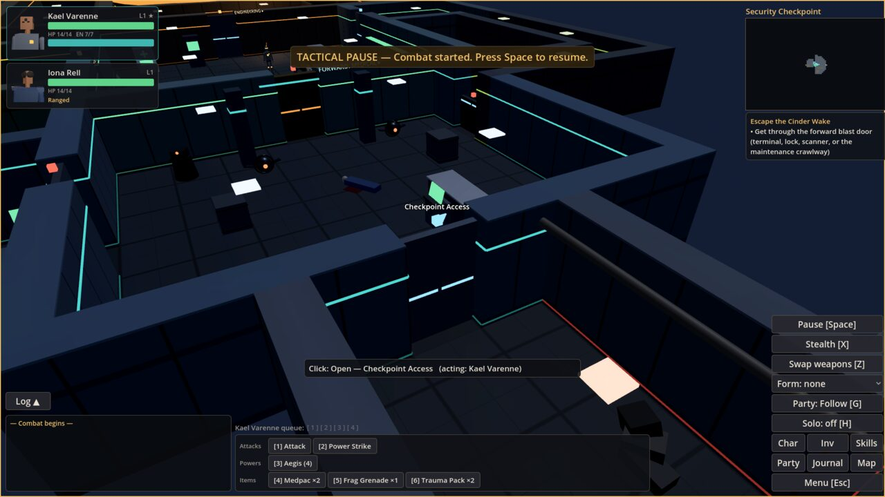
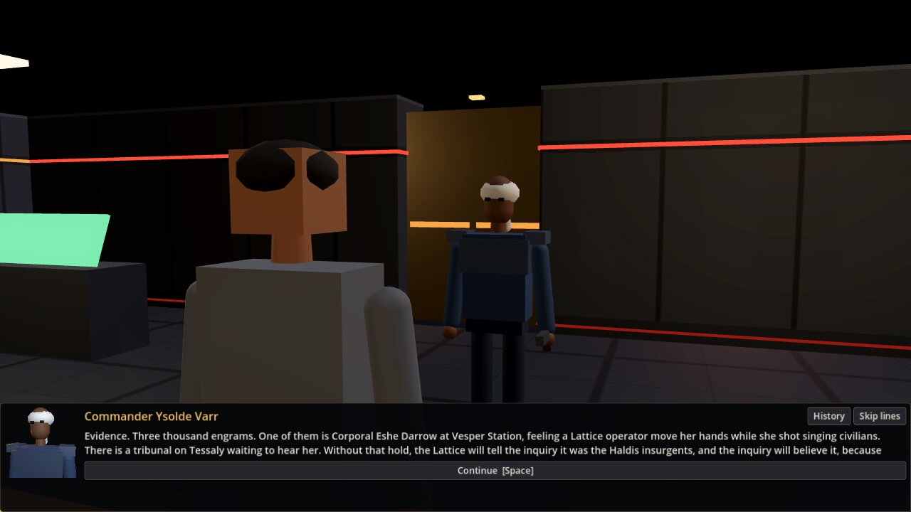

# Ashes of the Concord

An original single-player, third-person, real-time-with-pause sci-fi RPG vertical slice in the tradition of
d20 party RPGs. You wake aboard the evacuation tender **Cinder Wake** as a discharged Lattice Corps operator.
The ship's security intelligence, WARDEN, has turned on its passengers. Reclaimers from Haldis Reach have
boarded to take back an archive of stolen minds. Commander Varr has sealed herself in launch control. You have
one launch craft, fifteen seats, and decisions to make about who gets them.

- **Nine connected areas** (plus side rooms) ending at a launch, a companion exchange, a revelation and an
  end-of-intro save. Play time has not been measured with human players. The bots, which take direct routes,
  need 2.5–3.5 minutes of simulated world time; conversations pause that clock.
- **Character creation:** 3 archetypes, 3 backgrounds, a 30-point attribute buy, 8 skills, feats and Resonance
  powers with prerequisites, appearance presets, pronouns, recommended builds.
- **Combat:** d20 rules in 3-second rounds with a 4-action queue per character, tactical pause and auto-pause,
  critical confirmation, saves, damage types, the Lumen Edge with bolt deflection, combat forms and status effects.
- **Party:** two companions, **Iona Rell** (ship's security) and **Tav-7** (medical/maintenance synthetic), each
  with 0–100 influence and their own conversations. Choices move you along a Mercy ↔ Dominion alignment axis.
- **Exploration and skills:** every skill has uses on the ship. The forward checkpoint can be solved by combat,
  technical skill, stealth or conversation.
- **Story:** two optional quests, decisions whose consequences show up later, data-driven dialogue
  (28 conversations, about 430 nodes), opening on an in-engine prologue flythrough of the ship.
- **Presentation in the style of the classic d20 space RPGs:**
  - **Conversations:** characters speak in made-up languages, babbled from synthesised syllables with a voice
    per character. Lines reveal at your text speed. Speakers turn and gesture, and the camera cuts between
    over-the-shoulder, close-up and two-shot coverage. Approval and Mercy/Dominion shifts show as you make
    them.
  - **Ambient talk:** companions banter, bark in combat and ask to talk when something is on their mind.
    WARDEN and the purser make shipwide announcements.
  - **The ship:** red alert lighting, haze, flickering damage, a turning reactor and breathing archive
    cores, ceilings, and layered ambience.
  - **Camera:** a close follow camera by default, with the tactical orbit one setting away.
  - **Combat:** stances and flourishes, dodges and blocks, sparks, a Lumen Edge that ignites in a fight,
    health bars over heads, and feedback for experience, level-ups, journal and codex updates.
- **Economy:** inventory and 10 equipment slots, a vendor, crafting with upgrades, and three minigames: Shards
  (cards), Slipstream (hover racing) and the Petrel's turret.
- **Later-game systems,** reachable through developer presets: prestige specializations (3 families × Mercy and
  Dominion variants) and Iona's Resonance training.

Everything is original: story, characters, factions, dialogue, rules text, procedural geometry, and procedurally
synthesized audio, including the babbled voices. A test scans all player-facing text for borrowed franchise
terms. See [docs/ASSETS.md](docs/ASSETS.md).





## Requirements

- **Godot 4.4.1-stable** (pinned; the project uses `config/features = 4.4` and the GL Compatibility renderer).
  Download the standard (non-.NET) build from godotengine.org. The commands below assume it is on your `PATH` as
  `godot`.
- A GPU with OpenGL 3.3, or a software rasterizer for testing (it runs, slowly, on Mesa llvmpipe).
- Python 3 is needed only to regenerate content (`tools/*.py`). It is not needed to play or test.

## Run

```bash
godot --path .            # opens the game (title screen)
godot -e --path .         # opens the editor
```

### Command-line options for testing (after `--`)

| Option | Effect |
|---|---|
| `--quickstart=vanguard\|operative\|adept` | skip creation and start a new game with that recommended build |
| `--preset=<id>` | start a developer preset (see `data/dev_presets.json`, or Title → Developer Presets with `--dev`) |
| `--dev` | developer mode: F12 developer menu, presets on the title screen |
| `--pos=x,z[,rot]`, `--cam=yaw,pitch,dist` | place the party and camera (with `--quickstart` or `--preset`) |
| `--open=character\|inventory\|journal\|vendor\|workbench\|levelup\|settings\|prestige\|dev…` | open a screen on start |
| `--open=dialogue:<id> [--npc=<id>] [--obj=<id>] [--advance=N]`, `--open=cinematic:<id>`, `--open=bark:<id>`, `--open=banter` | start a conversation (optionally stepping N lines), a cinematic, an ambient line or a banter exchange |
| `--camera=follow\|tactical` | camera mode for this run |
| `--ui=creator [--ui_step=N --ui_class=adept]`, `--ui=practice_shards\|practice_slipstream\|practice_turret` | open a screen from the title |
| `--shot=file.png --quit_after=N` | save a screenshot after N frames and quit |

Example: `godot --path . -- --preset=jump_bay --dev`

## Controls (defaults; rebind in Settings → Controls)

| Action | Key / mouse |
|---|---|
| Move / click-move | W A S D or arrows / left-click the floor |
| Camera orbit, zoom, rotate | right-drag, wheel, Q / T (Settings → Controls → Camera: close follow or tactical) |
| Interact or talk (nearest) | E, or left-click the object or person (E beside a companion who wants to talk starts that conversation) |
| **Tactical pause** | Space (combat auto-pauses at the start with a basic attack already queued; queue anything to replace it) |
| Attack the target / cycle targets | F / R (left-click a hostile to target; double-click to attack) |
| Action bar (feats, powers, items) | 1 … 0 (actions go into the 4-slot queue; Backspace clears it) |
| Switch character / hold / solo | Tab / G / H |
| Stealth / swap weapon set / rest | X / Z / V |
| Character, Inventory, Abilities, Party, Journal, Map | C, I, K, P, J, M |
| Combat log / quicksave / quickload / help | L / F5 / F9 / F1 |
| Menu, back | Esc |
| Developer menu (dev mode) | F12 |

In dialogue: 1–9 choose an option. Space or a click first shows the whole line, then continues. Options
show the skill and DC, your chance of success, any requirement you don't meet, and a coloured strip for their
tone.

## Tests

```bash
./tools/run_tests.sh                       # full suite (headless); fails on any failed test or SCRIPT ERROR
./tools/run_tests.sh --only=world          # one test file (substring of tests/test_*.gd)
./tools/run_tests.sh --only=playthrough --test=martial   # one test method
./tools/bot_sweep.sh 1 8                   # replay the three bot playthroughs with 8 different dice seeds
./tools/check_scripts.sh                   # import and report parse errors
```

The suite (unit, data validation, UI smoke, world regressions, minigames, audio assets, presets) includes
**three automated end-to-end playthroughs**. A bot drives the real game through the same command API the input
layer uses: martial (Vanguard), technical (Operative) and diplomat (Adept), from a new game to the escape. These
are automated integration runs, **not human playtests**. Latest results are in
[docs/TEST_RESULTS.md](docs/TEST_RESULTS.md).

Set `AOTC_DEBUG=1` to trace door openings, enemy alerts and move orders on stdout.

## Export

`export_presets.cfg` defines **Linux** and **Windows** (x86_64) presets. They export only resources, include the
JSON data, and exclude `tests/`, `tools/` and `docs/`. With Godot 4.4.1 export templates installed:

```bash
godot --headless --path . --export-release "Linux"   builds/linux/AshesOfTheConcord.x86_64
godot --headless --path . --export-release "Windows" builds/windows/AshesOfTheConcord.exe
```

Each export is a binary plus `AshesOfTheConcord.pck` (about 4 MB). `builds/` is not committed.

## Developer presets

Presets build a fresh game from a recommended build. They apply a world state captured from a real bot
playthrough (`data/dev_stages.json`, regenerated by `godot --headless --path . res://tools/godot/gen_dev_stages.tscn`)
and then their own overrides.

- **Prestige:** `prestige_bulwark`, `prestige_iron_marshal`, `prestige_lumen_weaver`, `prestige_void_cantor`,
  `prestige_ghost_envoy`, `prestige_night_broker`. Each is a level-6 character eligible for exactly that
  variant; open Character → Specialization.
- **Iona's Resonance training:** `iona_training`. Open Party → Talk to Iona.
- **Jumps:** `jump_checkpoint`, `jump_engineering`, `jump_archive`, `jump_command`, `jump_bay`.

Preset games are tagged as developer games, and saves made from them show `[DEV]`.

## Project layout

```
data/            JSON content: classes, skills, feats, powers, items, enemies, encounters, quests, dialogue/,
                 ship_layout.json (generated), dev_presets.json, dev_stages.json (generated)
scripts/core/    autoloads: Events, DB (+ DataValidator), Settings, GameAudio, Game (+ GameState), Saves, DevTools
scripts/rules/   pure rules (no nodes): dice, combat, statuses, queue, inventory, equipment, crafting, vendor,
                 progression, build validation, prestige, conditions, effects, quests, dialogue engine, stealth
scripts/world/   World (simulation driver), grid navigation, level builder, actors, AI, combat manager, camera, FX
scripts/ui/      HUD and every screen; scripts/minigames/ Shards, Slipstream, turret
tests/           headless test runner, suites, playthrough bot and routes
tools/           content authoring (Python: layout, dialogue, audio), test/sweep scripts, Godot tools (stages, bench)
docs/            plan, architecture, coverage, branch map, test results, progress, assets, screenshots
```

Start with [docs/ARCHITECTURE.md](docs/ARCHITECTURE.md) and [docs/COVERAGE.md](docs/COVERAGE.md).
